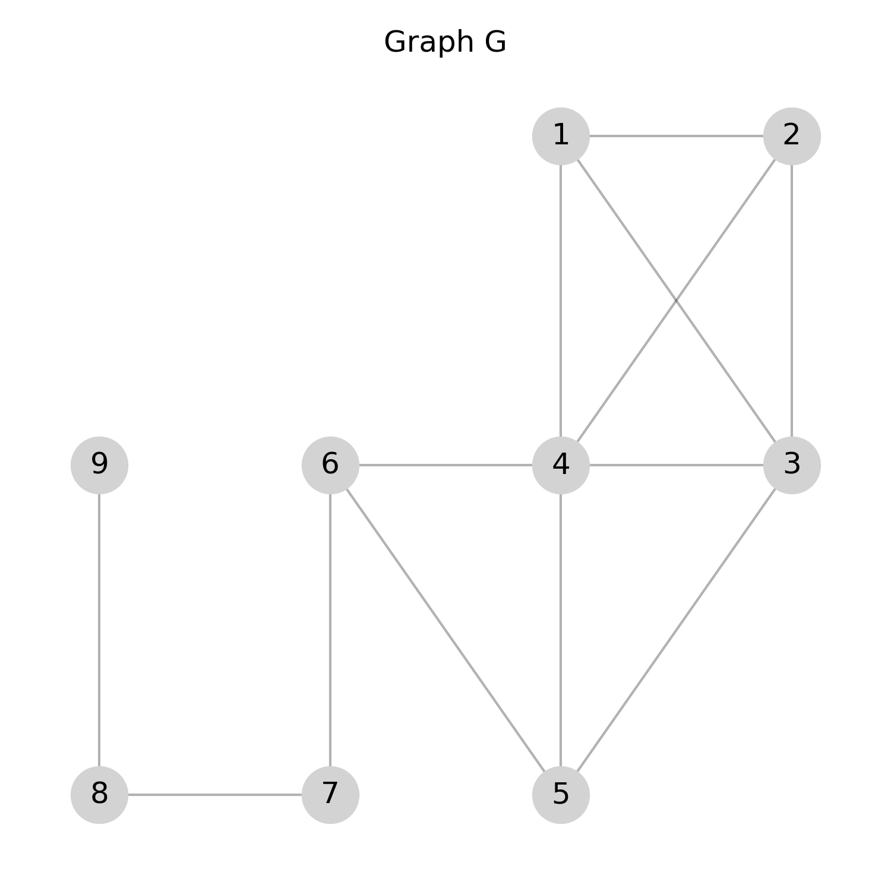
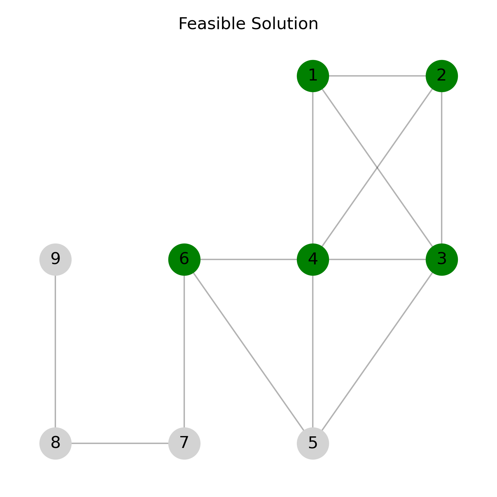
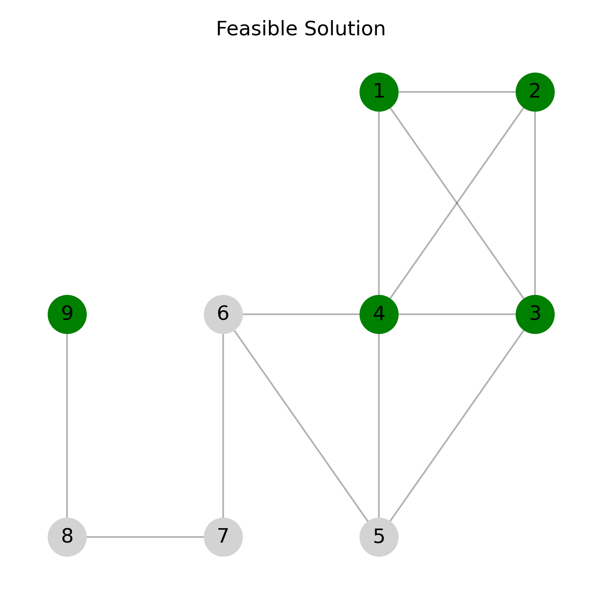

<!--
SPDX-FileCopyrightText: 2026 Daniela Scherer dos Santos <dssantos@dei.uc.pt>
-->

<!-- markdownlint-disable MD033 -->

# Multiobjective Quasi-clique Problem

This document provides a formal definition of the **Multiobjective Quasi-clique (MOQC)** problem, including input formats and illustrative examples. It is intended to complement the implementations available in this repository.


## Introduction

Given a graph $G$, a quasi-clique is defined as any subgraph of $G$ with a density greater than or equal to a specified threshold $\gamma$ [1].
Two combinatorial optimization problems can be defined for quasi-cliques: ($i$) the Densest k-subgraph (DKS) [2], which asks for a subgraph of fixed number of vertices $k$ with maximum density, and ($ii$) the Maximum Quasi-clique (MQC) [1] problem, which aims to find a quasi-clique of maximum number of vertices and density greater than or equal to a given threshold $\gamma$.

Both DKS and MQC require specifying in advance the desired number of vertices ($k$) and the minimum density threshold ($\gamma$), respectively. However, in many practical applications, providing this information with a high degree of precision can be challenging and limiting.

The **Multiobjective Quasi-clique (MOQC)** [3] problem was proposed to overcome this limitation by simultaneously optimising the number of vertices and the density of the subgraph, without requiring a predefined density threshold or fixed cardinality.

The problem is NP-hard [3] with many relevant applications fields such as social networks, telecommunications, and bioinformatics.

## Task

Given a graph, the goal is to identify a set of feasible quasi-cliques that approximates the set of **efficient** quasi-cliques as closely as possible.

A quasi-clique is considered **efficient** if there is no other feasible quasi-clique with at least as many vertices and at most the same density, with at least one of these inequalities being strict.

## Detailed description

Consider an undirected and simple graph $G = (V,E)$, where $V$ and $E$ are the vertex and edge sets of $G$, respectively. For a set of vertices $S \subseteq V$, we denote by $G_S=(S,E(S))$ the subgraph (quasi-clique) induced by $S$ in $G$.
The density of $G_S$, denoted by $dens(G_S)$, is the ratio between the number of edges in $G_S$ and the number of edges in a complete graph with $|S|$ vertices, that is,

$$
dens(G_S) = \frac{2 \cdot |E(S)|}{|S| \cdot (|S|-1)}
$$


Given $G$, the MOQC problem asks for a quasi-clique $G_S$ induced by $S \subseteq V$ such that  

$$S \in \underset{S^\prime \subseteq V}{\arg\max} \lbrace \left(dens(G_{S^\prime}),  |S^\prime| \right) \rbrace$$

### Connected Variant


The MOQC problem does **not require** the induced subgraph to be connected.

However, a **connected variant** can also be considered, where feasible quasi-cliques must induce a connected subgraph. This variant is particularly relevant in applications where connectedness is essential.


## Instance data file

Each instance file represents an **undirected simple graph** in a format commonly used for real-life graphs (e.g. Matrix Market '.mtx' files). Its structure is as follows:

### Comments

- Lines starting with '%' are **comments**.
- They often contain metadata, descriptions, or source information about the graph.
- These lines should be ignored when reading the graph.

### Header

The first non-comment line contains two integers:

- **First number:** Total number of vertices in the graph.
- **Second number:** Total number of edges in the graph.

### Edges

Each of the following lines represents an edge between two vertices. For example `1 2` indicates an edge between vertex 1 and vertex 2. Vertices are numbered consecutively from 1 to $|V|$.


## Example


```text
%%MatrixMarket matrix example
9 13
1 2
1 3
1 4
2 3
2 4
3 4
3 5
4 5
4 6
5 6
6 7
7 8
8 9
```

### Explanation

The following figures illustrate the MOQC problem for the example instance previously mentioned.

#### Original Graph G

This figure shows all vertices and edges in the input graph.



#### Feasible Solution

In the following figure, the quasi-clique induced by the green vertices corresponds to the **feasible solution** provided in the example. It contains 5 vertices, 7 edges, and $dens=0.70$.



Notice that the MOQC problem does not impose any constraint on the connectedness of the solution quasi-clique. Therefore, a feasible quasi-clique can also be **unconnected**. 
The following figure shows such an example for the same input instance. It contains 5 vertices, 6 edges, and $dens=0.60$.



## References

[1] Abello, J., Pardalos, P.M., Resende, M.G.C., 1999. On Maximum Clique Problems in Very Large Graphs. American
Mathematical Society, USA. p. 119–130.  

[2] Corneil, D.G., Perl, Y., 1984. Clustering and domination in perfect graphs. *Discrete Applied Mathematics* 9, 27–39. [https://doi.org/10.1016/0166-218X(84)90088-X](https://doi.org/10.1016/0166-218X(84)90088-X).

[3] Daniela Scherer dos Santos, Kathrin Klamroth, Pedro Martins, and Luís Paquete.
2024. Solving the Multiobjective Quasi-clique Problem. European Journal of Operational Research (2024). [https://doi.org/10.1016/j.ejor.2024.12.018](https://doi.org/10.1016/j.ejor.2024.12.018).
